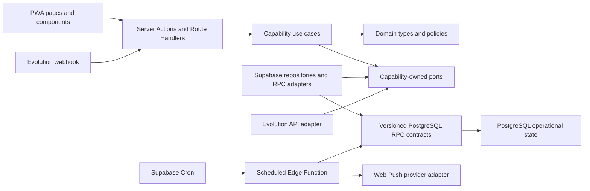
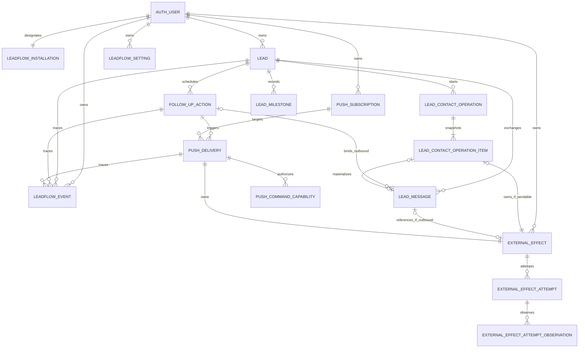
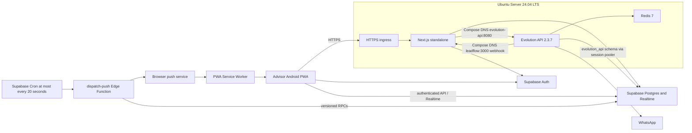

# Architecture Spine — LeadFlow pilot

## Design Paradigm

LeadFlow remains an evolutionary modular monolith. Next.js owns presentation and request entrypoints; capability modules own use cases and ports; domain code owns state vocabulary and policies; Supabase, Evolution API and Web Push are replaceable adapters. PostgreSQL is the transactional authority. Supabase Edge Functions are scheduled entrypoints, not a second domain implementation.

Arrows mean “may depend on”:



## Invariants & Rules

### AD-1 — [ADOPTED] Capability-owned modular boundaries

- **Binds:** all application capabilities
- **Prevents:** business rules duplicated across React components, Server Actions, webhooks and Edge Functions; infrastructure types leaking into domain code
- **Rule:** new code in `app/` and `components/` may call capability use cases but may not call Supabase or provider SDKs directly. Each capability under `lib/` owns its use cases and ports; adapters depend on those ports. Cross-capability work goes through an exported use case or domain contract, never another capability's repository internals. The current dashboard Realtime subscription is a documented brownfield exception, not a pattern: the first story that changes it must move it behind a `lib/leads` hook/adapter that emits invalidations while preserving automatic-update state and manual full refresh.

### AD-2 — [ADOPTED] Compatibility-preserving brownfield evolution

- **Binds:** all stories and migrations
- **Prevents:** rewrites, destructive schema replacement and regressions of already proven capture, dashboard, WhatsApp, Realtime, catalog or soft-delete behavior
- **Rule:** evolve through additive numbered migrations and incremental module extraction. Backfill and verify existing rows before removing an old column, policy, grant, route or mutation path. A story is incomplete unless existing relevant checks and the new behavior both pass.

### AD-3 — [ADOPTED] Authenticated single-advisor ownership boundary

- **Binds:** NFR-005–NFR-008; leads, messages, follow-up actions, settings, subscriptions, effects, deliveries, milestones and events
- **Prevents:** public read or mutation of private CRM data; mismatched ownership between related rows; a security cutover that hides data or breaks the Evolution webhook
- **Rule:** the pilot has one administratively provisioned Supabase Auth account using email and password; public signup is disabled and no signup route exists. A database-owned singleton `leadflow_installation` stores the sole `advisor_user_id` as a foreign key to `auth.users`; it is the only identity authority for migrations, Next.js, Edge Functions and the Evolution webhook. `leads.user_id`, `leadflow_settings.user_id`, `push_subscriptions.user_id`, `external_effects.user_id` and `leadflow_events.user_id` are direct ownership roots. Messages, follow-up actions, contact operations and milestones derive ownership only through required `lead_id`; contact-operation items derive through required `operation_id -> lead_id`; effect attempts derive through required `effect_id`. Deliveries derive through both required `action_id -> lead_id` and `subscription_id`, which must resolve to the same owner; effects and events validate every referenced entity against that singleton owner. Private tables enable RLS for `authenticated`, with interactive access constrained to `auth.uid()` along this exact graph. `requireAdvisor()` compares `auth.uid()` with the singleton; privileged provider and scheduler RPCs derive the owner internally and accept no owner parameter. Those RPCs use fixed `search_path`, explicit ownership checks and no execute grant to `public`, `anon` or `authenticated`; their privileged callers are created only after entrypoint authentication. `car_models` and `car_model_images` alone may retain public read-only policies.

  Auth/RLS ships in two phases. **Phase A** verifies the advisor UUID and backup, creates the immutable singleton in an additive migration while anonymous compatibility still exists, and deploys `/login`, logout, `proxy.ts`, cookie refresh, `getClaims()` authorization and a dual-compatible privileged Evolution webhook behind `AUTH_REQUIRED=false`. During this phase every new private write receives the singleton owner; the webhook may match legacy null-owned rows only while the flag is false. **Phase B** places advisor UI writes in maintenance but keeps the webhook HTTP route live. Every webhook mutation takes a shared transaction advisory lock named `leadflow_auth_cutover`; the bounded cutover transaction takes the exclusive form of the same lock, waits for in-flight callbacks, backfills and locks every ownership root, asserts the Auth user exists and zero null/orphan/mismatched rows remain, installs authenticated RLS, and revokes private anonymous policies/RPC grants. New callbacks wait behind that transaction and process under the new rules after commit. The database lock budget must be shorter than the configured webhook request timeout; exceeding it aborts and rolls back the cutover before any waiting callback is released with an error. Only after login, read, reversible write, Realtime and webhook smoke tests pass does deployment enable `AUTH_REQUIRED` and reopen UI writes. Provider-message uniqueness remains the callback dedupe boundary throughout.

  After Phase B, direct update/delete privileges on the singleton are revoked and a database guard rejects changes from every runtime role; the advisor UUID is immutable for the pilot. Account replacement is forbidden to application code and administration tooling. It may occur only in a future reviewed maintenance migration that closes writes, validates the new Auth user, locks the singleton, updates every direct ownership root, asserts zero old/null/mismatched owners, changes the singleton last, invalidates the old user's sessions and reopens only after RLS/Realtime/webhook smoke tests. Environment copies may be fail-closed deployment assertions but are never an identity authority. Missing identity or any failed assertion leaves production in maintenance; after revocation, rollback never reopens anonymous private-data access and proceeds by fix-forward or prepared compatible build.

### AD-4 — [ADOPTED] PostgreSQL-owned operational state and explicit projections

- **Binds:** FR-001–FR-013, FR-034–FR-040, NFR-001–NFR-002
- **Prevents:** two sources of truth for the next action; day-at-midnight reminders; state derived independently in clients; partial updates across related tables
- **Rule:** `lead_follow_up_actions` owns the action lifecycle. Every action has a monotonic `action_version bigint`, incremented in its owning RPC on every command-relevant change: status, type, schedule, response `source_message_id`, response preview/context or terminal transition. `leads.next_action_at` and `leads.next_action_type` are read projections of the first open action under the total order `(scheduled_for ASC, created_at ASC, id ASC)` and may only be maintained by a database trigger or transactional RPC; clients never re-rank that projection independently. Every `scheduled_for` is an exact UTC instant resolved server-side from an explicit date and time interpreted in `America/Guayaquil`; new writes may not use the existing days-only/midnight helper. General actions accept date plus time. Shortcut resolution is deterministic: `POSTPONE_PLUS_ONE_HOUR` is command time plus one exact hour; `POSTPONE_LATER` resolves to today at 16:00 when local time is before 16:00 and otherwise to tomorrow at 09:00; `POSTPONE_TOMORROW` resolves to tomorrow at 09:00; `POSTPONE_IN_THREE_DAYS` resolves to three local calendar days later at 09:00; `CHOOSE_DATE_TIME` is available only from the authenticated PWA and uses the explicit advisor-selected local date/time. All values are converted to UTC before persistence. `lead_messages` owns provider message status and deterministic classification evidence; `lead_contact_operations` owns first-contact execution; `lead_milestones` owns manually recorded commercial milestones. Realtime only invalidates or refreshes projections and never schedules work or performs effects.

### AD-5 — [ADOPTED] One convergent response action per lead

- **Binds:** FR-003–FR-009, FR-011–FR-013, FR-038, FR-040, SM-004
- **Prevents:** duplicate “Responder al cliente” work, nondeterministic lead matching, out-of-order messages regressing context, manual snooze being lost and cancellation of unrelated actions
- **Rule:** extend `next_action_type` with `RESPONSE`, record action `origin` and enforce at most one `RESPONSE` in `PENDING` or `POSTPONED` per lead with a partial unique index. Persist normalized `leads.phone_e164`; the backfill preserves invalid legacy phone text unchanged as non-matchable evidence and reports it for repair rather than coercing or deleting it. Resolve inbound messages for the singleton advisor to the newest non-deleted lead by `(created_at DESC, id DESC)`; multiple matches emit `inbound_lead_match_ambiguous`. Provider identity is unique on `(evolution_instance, provider_message_id)`; a message without a stable ID emits `inbound_message_rejected` and cannot mutate an action. One privileged RPC serializes inbound processing per lead. Before convergence, a versioned pure domain policy applies the PRD's exact allowlist and token rules: `NO_SUGGESTION` creates no response action; `PENDING` creates or advances the single response action; `REVIEW` creates or advances the same response action while preserving the `REVIEW` label. The policy never uses AI and never closes an action. Advisor corrections use the same versioned action-transition RPC: `REQUIRES_RESPONSE` records the manual decision, makes the final visible label `PENDING`/`Respuesta pendiente` and creates or advances the single response action, while preserving an explicit `POSTPONED` schedule; `NO_RESPONSE_REQUIRED` records the manual decision, makes the final visible label `NO_RESPONSE_REQUIRED`/`No requiere respuesta` and closes the current response action as `IGNORED`. The automatic classification and manual correction remain separate evidence. “Latest” is max `(provider_occurred_at, provider_message_id)`; ingestion time is separate and substitutes only for a missing/invalid provider timestamp. Older replays may fill missing message evidence but cannot regress latest context, `source_message_id` or schedule. A newer message sets a non-posponed `PENDING` or `REVIEW` response to its occurred time plus one hour. If the response action is `POSTPONED` by an explicit advisor command, a newer message updates source, preview, context, classification and `action_version` but preserves the existing `scheduled_for` exactly; the explicit postponement prevails and the new message does not advance the action. Any change to the bound `source_message_id`, preview, context or classification increments `action_version`. Every advisor command against a response action carries both `expected_action_version` and the `expected_source_message_id` rendered to the advisor; the RPC compares owner, open state, version and source atomically. A mismatch returns successful functional `STALE_ACTION`, performs no mutation and forces a fresh read. If an advisor terminal transition commits first, a later new inbound message creates the next response action; if inbound convergence commits first, the stale advisor command cannot close it. The RPC preserves unrelated actions and returns `INSERTED`, `ADVANCED`, `ENRICHED` or `DEDUPLICATED`. `DONE`, `IGNORED`, `CANCELED` and postpone transitions are idempotent and require no note; `CANCELED` also appends `next_action_canceled` in the same transaction.

### AD-6 — [ADOPTED] Authorized mutation paths and atomic local transitions

- **Binds:** all writes, NFR-002, NFR-007, NFR-014
- **Prevents:** client-side authorization assumptions, SSR-cookie clients used for provider traffic, state/event drift and Node/Deno copies of shared policy
- **Rule:** there are four exclusive entry modes: session-authenticated advisor commands, capability-plus-session Push commands under AD-15, provider-token-authenticated Evolution callbacks, and scheduler-secret-authenticated jobs. Private pages, loaders, Server Actions and Route Handlers call `requireAdvisor()` using `getClaims()` for authorization (`getUser()` only when fresh user data is required); `proxy.ts` refreshes cookies and redirects but is never the sole authorization check. Provider/scheduler paths never use cookies and call the singleton-owner privileged RPCs from AD-3. Next.js entrypoints validate input and delegate to capability use cases; the Deno Edge Function performs only bounded orchestration and provider I/O. Cross-runtime state policy lives in additive, versioned PostgreSQL RPC contracts—at minimum inbound convergence, versioned action transition, `claim_effect_v1`, `begin_effect_io_v1`, `reap_effects_v1`, `record_effect_result_v1`, `reconcile_effect_v1`, Push materialization/repair and consume-notification command—and governed tables may not be mutated directly by either runtime. Every advisor action mutation supplies `expected_action_version`; response commands also supply `expected_source_message_id`. The owning RPC compares owner, open state and those preconditions, and commits the first valid transition plus its canonical event atomically; mismatches return `STALE_ACTION` without mutation. Database status codes are the shared contract.

### AD-7 — [ADOPTED] Durable idempotency before every external effect

- **Binds:** FR-010–FR-025, FR-030–FR-033, NFR-001–NFR-004
- **Prevents:** duplicate WhatsApp sends, duplicate Push notifications, two workers owning one attempt and automatic resend after an uncertain provider outcome
- **Rule:** `lib/effects` and its PostgreSQL RPCs are the sole owner of every provider-effect state machine. `external_effects` has `id uuid` PK, required singleton `user_id`, controlled `effect_kind` and `provider`, stable `business_key`, controlled `state`, monotonic `effect_version bigint`, `current_attempt_no`, nullable `next_attempt_at`, `review_required`, `created_at` and `updated_at`, with unique `(user_id, effect_kind, business_key)`. `external_effect_attempts` has PK `(effect_id, attempt_no)`, unique `claim_token_digest`, `claimed_by`, `claimed_at`, `lease_expires_at`, nullable write-once `request_started_at` and `payload_digest`, plus nullable current `completed_at`, `result_kind` and safe provider request/status projection. Every provider or reconciler observation is append-only in `external_effect_attempt_observations` with UUID `id`, required `(effect_id, attempt_no)`, `observed_at`, controlled `observation_kind`, `source`, nullable safe provider request/status, `evidence_digest` and `correlation_id`, unique on a stable provider-observation key. Attempt identities and observations are never deleted or overwritten. Raw claim tokens and raw provider payloads are never persisted. Capability aggregates reference this ledger rather than owning parallel effect states: `push_deliveries.external_effect_id` is required and unique; every sendable `lead_contact_operation_items.external_effect_id` is required and unique while unavailable items keep it null; every outbound `lead_messages.external_effect_id` is unique and, when produced by a contact item, equals that item's effect. A deferred constraint trigger enforces by `effect_kind` that each effect has exactly one source aggregate (`WEB_PUSH` delivery, `WHATSAPP_FIRST_CONTACT` item or `WHATSAPP_REPLY` outbound message); future kinds require an architecture and migration update. Capability status columns are read projections updated only by Effects-owned RPCs; Effects owns claim, cancellation, result and reconciliation authority.

  `claim_effect_v1` locks the effect, compare-and-sets eligible `READY`/`RETRYABLE` state to `CLAIMED`, increments `effect_version`, increments `current_attempt_no`, creates the immutable attempt identity and returns the raw claim token once. Every adapter must then call `begin_effect_io_v1(effect_id, attempt_no, raw_claim_token, payload_digest)` immediately before network I/O. That RPC locks the effect and current attempt, verifies state `CLAIMED`, latest attempt number, matching token digest, unexpired lease and null `request_started_at`; it writes the payload digest when absent or requires an exact match when Push preparation already sealed it, then commits `request_started_at`. Any failure is a hard prohibition on provider I/O. After that fence, the adapter may make exactly one provider HTTP/SDK request for that attempt: automatic retries and automatic non-GET redirect replay are disabled. Any additional request requires a new attempt authorized by the Effects state machine and, where remote acceptance is uncertain, the same proven provider idempotency key or definitive query-by-key evidence. `reap_effects_v1` acquires the same effect lock: if it wins first, an expired unstarted attempt becomes `RETRYABLE` and the old worker's begin fails; if begin wins first, expiry can produce only `UNKNOWN`, never automatic resend. The exact successfully started worker may append a late result with its token after lease expiry. A definitive result for the latest started attempt may reconcile `CLAIMED`/`UNKNOWN` to `ACCEPTED` or `REJECTED_TERMINAL`; an older attempt is evidence only. `UNKNOWN -> READY` is allowed only when a reliable query-by-key proves no effect occurred or the provider guarantees reuse of the same remote idempotency key; ambiguity stays `UNKNOWN`. Every logical-state mutation increments `effect_version` and appends its canonical AD-10 transition event in the same transaction. UI disabling and local idempotency never claim provider-level exactly-once behavior.

### AD-8 — [ADOPTED] Explicit contact and exact WhatsApp action completion

- **Binds:** FR-010, FR-013–FR-017, SM-003–SM-004, SM-006
- **Prevents:** contact on lead creation, repeated accepted resources, fake message rows for unavailable media, uncertain sends closing work and one WhatsApp result closing the wrong action
- **Rule:** saving a lead never sends WhatsApp. An explicit first-contact command creates or reuses the `FIRST_CONTACT` aggregate in `lead_contact_operations`, unique on `(lead_id, operation_type)`, with monotonic `operation_version`. `lead_contact_operation_items` stores the immutable requested snapshot with one stable `item_key` per resource (`TEXT`, `PHOTO:<asset_id>`, `TECH_SHEET:<asset_version>`), availability and the one-to-one AD-7 effect reference, unique within the operation. `NOT_AVAILABLE` resources never create effects or provider-message rows; they remain unavailable until a new verifiable resource version is present. An actual provider send creates or links exactly one `lead_messages` row through `lead_message_id`; only that message owns provider accepted/delivered/read evidence. The operation result is a database-maintained projection of item/effect outcomes and separately reports `ACCEPTED`, `FAILED`, `UNKNOWN` and `NOT_AVAILABLE` items. `ACCEPTED` is terminal evidence and is never resent. `FAILED` is a definitive negative provider result and permits a manual retry only for that same resource, operation and version through a new Effects-authorized attempt. `UNKNOWN` cannot be retried until reconciliation or proof that no effect occurred; only then may the Effects state machine authorize a fresh attempt. Every projection change increments `operation_version` and appends `first_contact_result` in the same Effects-owned result transaction. No retry is automatic, whole-operation or blind. Separately, a reply sent from LeadFlow must bind its canonical effect and `lead_messages` row to exactly one explicit `follow_up_action_id`, `expected_action_version` and, for `RESPONSE`, `expected_source_message_id`. Only Evolution's accepted evidence for that bound effect lets the owning RPC mark that same still-open, still-current action `DONE` with source `LEADFLOW_WHATSAPP_ACCEPTED`; rejection, failure, `UNKNOWN` or stale version/source leaves the action open and returns a functional result. A native-WhatsApp confirmation uses the same versioned action-transition RPC with source `NATIVE_WHATSAPP_CONFIRMED` and no provider inference. First contact closes no action unless its initiating command explicitly binds that exact action and version.

### AD-9 — [ADOPTED] Server-scheduled Web Push with observable evidence levels

- **Binds:** FR-018–FR-025, NFR-003–NFR-004, NFR-015, SM-005
- **Prevents:** reminders that depend on an open PWA, stale-schedule notifications, duplicated endpoints and false claims of physical delivery or reading
- **Rule:** `push_deliveries` is a business projection with monotonic `delivery_version`. `push_subscriptions` has a database unique constraint on `(user_id, endpoint_digest)`, so one exact endpoint has one row and one current lifecycle; it has monotonic `subscription_version` for every lifecycle transition and increments `subscription_generation` whenever key material changes or an inactive endpoint is reactivated. Delivery identity is unique on `(follow_up_action_id, action_version, subscription_id, subscription_generation)` and snapshots `scheduled_for` plus `source_message_id`. A duplicate means more than one Push request for that exact tuple; two active valid subscriptions may each have one request, one per device, without constituting duplication. Every action-transition RPC and every subscription activate/reactivate/rotate/deactivate/invalidate RPC first locks the singleton `leadflow_installation` row `FOR UPDATE`, then locks affected action rows by UUID, subscription rows by UUID, delivery rows by UUID and external-effect rows by UUID. Under that one order it invokes `repair_push_materialization_v1`, whose postcondition is: exactly one canonical delivery plus one AD-7 effect identity exists for every current open (`PENDING` or `POSTPONED`) action × active current subscription generation. That identity remains the same while its delivery/effect advances through scheduled, claimed, generated and result states; repair never resets or recreates it. Missing identities are inserted and stale identities whose latest attempt has null `request_started_at` are canceled. A current `SCHEDULED` delivery is eligible for I/O only when its snapshotted `scheduled_for` is due and owner, action version, source and subscription generation still match; changing `action_version` alone never authorizes an immediate second send. A terminal action transition (`DONE`, `IGNORED` or `CANCELED`) never materializes a replacement: it cancels `READY`, `RETRYABLE` and only those `CLAIMED` effects whose latest attempt has null `request_started_at`, and revokes every unused capability. A Push delivery identity may commit at most one `request_started_at` and one provider request. A pre-I/O abandoned attempt may be replaced before any provider request starts; after `request_started_at` commits, result, reconciliation or failure never resends that identity, and any later eligible version or subscription generation is a different identity. A started `CLAIMED`, `UNKNOWN`, `ACCEPTED` or terminal-result effect remains immutable evidence, while all later result RPCs are barred from mutating the terminal or newer action. Deactivation or provider `404/410` applies the same pre-I/O cancellation/evidence rule to that subscription generation. A scheduler-authenticated repair call runs at the start of every dispatch invocation under the same lock order, idempotently inserts missing current pairs and cancels only stale pre-I/O ones. Database tests must force both commit orders for action/subscription races and assert the postcondition at every delivery lifecycle state.

  Materialization emits `push_delivery_scheduled`, never `push_generated`. Due `SCHEDULED` deliveries are claimed through their canonical effect. After AD-15 capability preparation, a successful `begin_effect_io_v1` atomically revalidates owner, open action/version/source and active subscription generation, commits the attempt's `request_started_at`, advances `delivery_version` to generated and emits `push_generated`; an invalid/stale candidate is canceled and performs no I/O. Supabase Cron invokes `dispatch-push` at most every 20 seconds; from invocation to committed `request_started_at` has a 10-second processing budget, so a worst-positioned due item plus one delayed invocation remains under 60 seconds. NFR-004 is measured as `request_started_at - scheduled_for_snapshot <= 60 seconds`. Effects-owned result RPCs advance both the canonical effect and delivery projection, increment `delivery_version` and record push-service accepted/rejected/unknown or invalid-subscription evidence atomically. PostgreSQL is the sole subscription encryption boundary: scoped RPCs encrypt/decrypt endpoint and key material with a versioned key held in Supabase Vault, persist `cipher_version` and `key_id`, expose no decryption key to Next.js or Edge, and rotate read-old/write-new before re-encrypting and retiring an unreferenced old key. The Service Worker displays notifications; commands obey AD-15 and unsupported devices fall back to the authenticated PWA. No state is called physically delivered or read without evidence at that level.

### AD-10 — [ADOPTED] Append-only product and audit events

- **Binds:** FR-009, FR-017, FR-020, FR-032, FR-038–FR-040, NFR-007, NFR-013–NFR-014, SM-001–SM-009
- **Prevents:** analytics split by synonymous events, duplicate success metrics on replay, mutable audit history, provider payloads treated as business state and logs containing secrets
- **Rule:** `leadflow_events` is insert-only for application roles and uses UUID `id`, required unique `event_key`, required singleton `user_id`, `event_type`, `schema_version smallint` default `1`, `occurred_at`, nullable entity references, controlled `source`, `stage`, `actor_kind`, nullable `actor_id`, non-unique `correlation_id`, nullable command `idempotency_key`, controlled functional `result`, nullable `error_code` and minimal validated JSONB `payload`. Every `TRANSITION` row additionally requires canonical `aggregate_type`, `aggregate_id` and positive `aggregate_version`; those fields are null for `ATTEMPT` and `FACT`. One database-owned `leadflow_event_registry` seeded by migration is the canonical vocabulary and payload contract below; its foreign key/check rejects every unregistered name. Every registry row has one exact key recipe in the canonical mappings below; callers never supply a free-form `stable_fact_id`, aggregate choice or version choice. Owning RPCs construct the key, insert with uniqueness enforcement and return the existing event identity on replay in the same transaction. A mutation of `external_effects.state` always increments `effect_version` and emits the mapped `EXTERNAL_EFFECT` transition; an attempt event can supplement but never replace it. Failures before commit use one best-effort canonical failure event with the same correlation ID; if Postgres is unavailable, structured stdout is the explicitly limited fallback retained and monitored by host logging. Update/delete grants are revoked; corrections append `audit_correction`. Secrets, cookies, headers and full provider payloads are forbidden, and operational tables remain state owners.

Canonical event registry, schema version 1:

| Event type | Class | Singular meaning |
| --- | --- | --- |
| `lead_created` | FACT | One persisted lead. |
| `lead_capture_failed` | ATTEMPT | One failed idempotent capture command and stage. |
| `next_action_created` | FACT | One persisted action identity. |
| `next_action_done` | TRANSITION | One exact action version closed as done. |
| `next_action_postponed` | TRANSITION | One exact action version reprogrammed. |
| `next_action_ignored` | TRANSITION | One exact action version closed as ignored. |
| `next_action_canceled` | TRANSITION | One exact action version logically deleted and closed as `CANCELED`. |
| `inbound_message_received` | FACT | One deduplicated provider message persisted and associated. |
| `inbound_message_rejected` | FACT | One canonical callback fingerprint rejected before action mutation. |
| `inbound_lead_match_ambiguous` | FACT | One inbound message matched multiple candidate leads. |
| `response_action_upserted` | TRANSITION | One response-action version inserted or advanced. |
| `first_contact_requested` | FACT | One first-contact operation requested. |
| `first_contact_result` | TRANSITION | One operation projection changed from item outcomes. |
| `push_delivery_scheduled` | FACT | One unique open-action/current-subscription delivery identity materialized. |
| `push_generated` | TRANSITION | One due delivery payload and command-capability set generated at the committed pre-I/O fence. |
| `push_service_result` | TRANSITION | One logical Push delivery reached accepted, rejected or unknown evidence. |
| `push_subscription_activated` | TRANSITION | One subscription generation became active. |
| `push_subscription_deactivated` | TRANSITION | One active generation was intentionally disabled. |
| `push_subscription_invalid` | TRANSITION | One generation was invalidated by provider evidence. |
| `push_action_taken` | TRANSITION | One valid capability consumed and its bound action changed. |
| `push_action_rejected` | FACT | One capability produced `STALE_ACTION` or `EXPIRED_CAPABILITY` without action mutation. |
| `push_duplicate_suppressed` | FACT | One duplicate delivery identity hit the canonical unique key. |
| `external_effect_claimed` | TRANSITION | One logical effect entered a claimed attempt. |
| `external_effect_io_started` | ATTEMPT | One exact attempt crossed its committed pre-I/O fence. |
| `external_effect_result_recorded` | TRANSITION | One logical effect recorded its initial provider-result state. |
| `external_effect_retry_scheduled` | TRANSITION | One logical effect was returned to bounded retry eligibility. |
| `external_effect_canceled` | TRANSITION | One logical effect was canceled before provider I/O. |
| `external_effect_reconciled` | TRANSITION | One `UNKNOWN` logical effect gained definitive audited evidence. |
| `purchase_decision_recorded` | FACT | One manual purchase-decision milestone. |
| `audit_correction` | FACT | One append-only correction naming the superseded event. |

`corporate_sync_*` is a PRD placeholder, not an emit-able event name. AD-14's future architecture update must add concrete, non-wildcard event types and schemas to this registry before corporate code exists.

Canonical mapping for every schema-version-1 `TRANSITION` event:

| Event type | `aggregate_type` | `aggregate_id` | `aggregate_version` | Owning RPC mutation |
| --- | --- | --- | --- | --- |
| `next_action_done`, `next_action_postponed`, `next_action_ignored`, `next_action_canceled`, `response_action_upserted`, `push_action_taken` | `FOLLOW_UP_ACTION` | `lead_follow_up_actions.id` | resulting `action_version` | versioned action/inbound/capability transition |
| `first_contact_result` | `LEAD_CONTACT_OPERATION` | `lead_contact_operations.id` | resulting `operation_version` | Effects result projection update |
| `push_generated`, `push_service_result` | `PUSH_DELIVERY` | `push_deliveries.id` | resulting `delivery_version` | begin-I/O or Effects result projection update |
| `push_subscription_activated`, `push_subscription_deactivated`, `push_subscription_invalid` | `PUSH_SUBSCRIPTION` | `push_subscriptions.id` | resulting `subscription_version` | subscription lifecycle transition |
| `external_effect_claimed`, `external_effect_result_recorded`, `external_effect_retry_scheduled`, `external_effect_canceled`, `external_effect_reconciled` | `EXTERNAL_EFFECT` | `external_effects.id` | resulting `effect_version` | Effects state transition |

Canonical identity for every schema-version-1 `FACT` and `ATTEMPT` event:

| Event type | `event_key` identity after `event_type` | Owning RPC evidence |
| --- | --- | --- |
| `lead_created` | `leads.id` | persisted lead identity |
| `lead_capture_failed` | client command `idempotency_key`, `stage` | rejected capture attempt |
| `next_action_created` | `lead_follow_up_actions.id` | persisted action identity |
| `inbound_message_received` | `lead_messages.id` | provider-message unique row |
| `inbound_message_rejected`, `inbound_lead_match_ambiguous` | canonical callback fingerprint | normalized instance, provider ID or raw-body digest when ID is invalid |
| `first_contact_requested` | `lead_contact_operations.id` | persisted operation identity |
| `push_delivery_scheduled` | `push_deliveries.id` | canonical delivery identity |
| `push_action_rejected` | capability row ID, functional result | one terminal no-op result per capability |
| `push_duplicate_suppressed` | digest of the canonical delivery unique-key tuple | conflicting materialization identity |
| `external_effect_io_started` | `external_effects.id`, `attempt_no`, literal `BEGIN_IO` | write-once `request_started_at` |
| `purchase_decision_recorded` | `lead_milestones.id` | unique purchase milestone |
| `audit_correction` | correction UUID, superseded event ID | append-only correction command |

### AD-11 — [ADOPTED] Manual purchase decision only in the current pilot

- **Binds:** FR-034–FR-035, SM-008
- **Prevents:** chat heuristics changing sales state; purchase evidence hidden in notes; `LeadStatus` overloaded with post-sale workflow
- **Rule:** In the current pilot, `lead_milestones` records only the advisor command `PURCHASE_DECISION`, with an operational recording timestamp, idempotent and unique per lead. `BLOCKER`, `DELIVERY` and purchase-to-delivery duration remain future/deferred and have no current UI, mutation or story. No webhook, message classifier or score may create any milestone.

### AD-12 — [ADOPTED] Secret and payload trust boundaries

- **Binds:** NFR-005–NFR-008; Supabase, Evolution API, Web Push and future provider adapters
- **Prevents:** credentials shipped in client bundles, legacy-key lock-in, forged callbacks and sensitive provider errors exposed to the advisor
- **Rule:** only the Supabase URL, `NEXT_PUBLIC_SUPABASE_PUBLISHABLE_KEY` and VAPID public key may reach the browser. Browser and cookie-scoped Next.js SSR clients use `NEXT_PUBLIC_SUPABASE_PUBLISHABLE_KEY`; the separate self-hosted privileged Next.js client uses server-only `SUPABASE_SECRET_KEY`. Existing browser `*_ANON_KEY` and Node `*_SERVICE_ROLE_KEY` names are fallback-only during migration and no new code introduces them. Hosted Edge Functions use a pinned `@supabase/server` admin context or parse the platform-provided `SUPABASE_SECRET_KEYS` map; singular `SUPABASE_SECRET_KEY` is local-CLI fallback only, and custom Edge secret names never use the reserved `SUPABASE_` prefix. A Supabase secret key is never sent as `Authorization: Bearer`. Cron calls `dispatch-push` with a publishable key in `apikey` plus distinct rotating `LEADFLOW_SCHEDULER_SECRET`; `[functions.dispatch-push] verify_jwt = false` makes the function explicitly authenticate that secret in constant time before creating an admin client or calling any claim RPC. Tests must reject absent/wrong secrets before privileged initialization, accept current and next values during rotation, reject the retired value afterward and prove a valid request reaches exactly one claim path. Production Next.js/Evolution secrets come from root-owned `0600` host files injected into Compose; Edge/Cron secrets live in Supabase project secrets/Vault. Secrets never enter Git, image layers or Compose manifests. Rotation installs current-plus-next, restarts only the dependent service, verifies readiness, then revokes the old value. Logs and `ActionResponse` expose functional codes and safe messages, never raw credentials or provider responses. Every Route Handler and Server Action is treated as public attack surface and performs authentication, authorization and validation.

### AD-13 — [ADOPTED] Small-host deployment with managed scheduling

- **Binds:** deployment, environments, operations, NFR-004
- **Prevents:** requiring a desktop UI, public bypass of TLS, Docker Desktop-only networking, mutable release images, production-first migrations and silent scheduler failure
- **Rule:** production runs headlessly on Ubuntu Server 24.04 LTS. The current `docker-compose.yml` is development-only and is not a production deployment path. A checked-in `compose.production.yml` is mandatory before go-live: it keeps Next.js, Evolution API and Redis on a private network, removes their direct host publications, publishes only TCP 443 from the HTTPS ingress and routes internally to `leadflow:3000`. SSH is administratively restricted; ports 3000, 8080/8081 and 6379 are never public. The exact proxy is a deployment-story choice, but automatic certificate renewal, Docker-aware host firewall rules and an external port scan are release gates. In-Compose callbacks use `http://leadflow:3000/api/webhooks/evolution` and provider access uses `http://evolution-api:8080`; `host.docker.internal` is development-only with explicit `host-gateway`. The production manifest and its checked-in image lock pin the Dockerfile build base, deployed LeadFlow image, Evolution and Redis by verified target-architecture OCI digest. Supabase remains managed; Evolution's `evolution_api` schema through its session pooler is included in connectivity and restore checks. Local uses Supabase local with synthetic fixtures, external effects disabled/mocked and full SQL/RLS/RPC tests; production is never the first migration execution. A separate remote preview project, if used, has distinct keys, data and test destinations. Server flags default off for new effects. `/api/health` is liveness; internal `/api/ready` checks the singleton advisor, Supabase and Evolution with bounded timeouts. Alert on a missed 20-second Push invocation or oldest due delivery reaching 40 seconds; page critically at 55 seconds, before the 60-second NFR-004 breach. Also alert on backlog over two minutes, `UNKNOWN`/terminal rejection rates, unhealthy containers or disk pressure. Acceptance tests cover a worst-positioned due instant and one delayed invocation while asserting `request_started_at - scheduled_for_snapshot <= 60 seconds`. Go-live requires verified backups, a restore drill, explicit RPO/RTO, rollback runbook and smoke checks for login, capture, dashboard, WhatsApp, Realtime and soft delete; a failed Push never closes its action.

### AD-14 — [ADOPTED] Corporate automation is discovery-gated

- **Binds:** FR-026–FR-033, NFR-002, NFR-005–NFR-008, SM-007
- **Prevents:** coding an unknown workflow, selecting Playwright prematurely, storing production credentials now or violating the reported one-active-lead rule
- **Rule:** no corporate adapter, browser worker, credential store or synchronization mutation may be added until the advisor meeting records the exact permitted operation, field mapping, authoritative active/finalized states, postcondition, recovery steps and a production-safe validation plan. The first approved implementation must enter through a `CorporateLeadSyncPort`, preserve preview plus fresh confirmation after reauthentication, stop on uncertainty and use AD-7 idempotency; HTTP/API and headless-browser adapters remain candidates rather than stack commitments.

### AD-15 — [ADOPTED] Push commands require owner session and one-use capability

- **Binds:** FR-006, FR-022–FR-024, NFR-001–NFR-002, NFR-005–NFR-007
- **Prevents:** bearer-only mutation, cross-owner object access, replay, capability leakage in URLs and stale notifications changing newer work after login
- **Rule:** `/api/push/actions` mutates only through same-origin JSON `POST`; it requires an `Origin` equal to the configured public application origin, rejects missing/cross-origin values, and `GET` is non-mutating. The closed command vocabulary is `DONE`, `IGNORE`, `POSTPONE_PLUS_ONE_HOUR`, `POSTPONE_LATER`, `POSTPONE_TOMORROW` and `POSTPONE_IN_THREE_DAYS`; commands accept no client-selected timestamp and resolve time by AD-4. `CHOOSE_DATE_TIME` is a manual authenticated-PWA action only and is never a Push command or client-supplied timestamp. For each due, claimed, not-yet-started Push attempt, the Edge worker generates one independent opaque random token of at least 128 bits per included command and an encrypted Push payload containing those raw tokens. Before begin-I/O it calls `prepare_push_capabilities_v1` with the claim token, command digests, encrypted-payload digest and `expires_at = issued_at + 24 hours`. That RPC verifies the current effect attempt, current open action/version/source and active subscription generation, then inserts one server-side digest row unique on `(push_delivery_id, attempt_no, command)`; it never receives or stores raw command tokens. `begin_effect_io_v1` accepts the same payload digest and cannot commit unless that exact complete capability set exists.

  Raw command tokens may exist only in Edge process memory until send, inside the encrypted Push payload, and afterward in browser-managed `Notification.data`; this narrow `Notification.data` handoff is required so `notificationclick` survives Service Worker termination/restart. Tokens are forbidden in URLs, query strings, fragments, logs, page messages, `localStorage`, `sessionStorage`, IndexedDB and Cache Storage. The Service Worker reads the selected token from `Notification.data`, sends it only in the same-origin POST body with `credentials: include`, and never hands it to an opened page. Missing/expired session returns `AUTH_REQUIRED`, opens `/login` without the token and performs no deferred or automatic execution; after login the advisor acts from refreshed PWA state.

  A pre-I/O abandoned/reaped attempt revokes its unobserved capability set before the effect becomes retryable. For a Push delivery identity, a provider result after `request_started_at`—accepted, rejected, failed or unknown—never authorizes a second request for that identity; only a new eligible action version or subscription generation can create a different identity. Once `request_started_at` commits, its capability set remains stable until consumed, its 24-hour expiry, a newer action version/source, subscription-generation invalidation, or delivery/action cancellation; those invalidations revoke every unused bound token. PostgreSQL stores only digest, singleton owner, `effect_id`, `attempt_no`, `follow_up_action_id`, `push_delivery_id`, exact command, `action_version`, nullable `source_message_id`, issue/expiry, consumption state and original functional result. A `security definer` RPC executable only by `authenticated` validates `auth.uid()`, digest, owner, command, current version/source, expiry and unused state, then atomically consumes it, performs the idempotent transition and appends `push_action_taken`. A valid but stale capability is consumed and records `push_action_rejected` with `STALE_ACTION`; an expired capability records `EXPIRED_CAPABILITY` without mutation; replay of a consumed capability returns its stored original functional result. `AUTH_REQUIRED` consumes nothing. Provider and scheduler credentials cannot invoke this RPC.

## Consistency Conventions

| Concern | Convention |
| --- | --- |
| SQL and TypeScript naming | PostgreSQL tables/columns/indexes/events use `snake_case`; TypeScript values and functions use `camelCase`; types and React components use `PascalCase`; database enum values use `UPPER_SNAKE_CASE`. |
| Capability files | Use `domain.ts` or `domain/` for policy vocabulary, `use-cases.ts` or `actions.ts` for commands, `ports.ts` for interfaces and named adapter files for Supabase/provider implementations. Existing files move only when a story benefits from the extraction. |
| IDs and time | Persist UUIDs and `timestamptz` in UTC. Interpret schedules and display dates in `America/Guayaquil`; never persist a browser-local timestamp without offset. |
| Command result | Preserve `ActionResponse<T>` as `{ success, data?, error?, warning? }` and add optional `code` and `correlationId` compatibly for functional errors and traceability. Do not throw provider payloads into UI responses. |
| Validation | Validate all external and user-controlled input at its server entrypoint. Normalize phone numbers once in the WhatsApp capability before lookup or send. |
| Transactions | Use a database RPC/transaction for compare-and-set state changes, uniqueness enforcement, claims, one-use token consumption and same-commit audit events. Push action/subscription/materialization work always locks singleton installation, actions by UUID, subscriptions by UUID, deliveries by UUID and external effects by UUID, in that order. |
| Idempotency | Keys are stable business-effect identities, stored under a unique constraint and reused across retries; random request IDs are correlation IDs, not idempotency keys. |
| Action concurrency | Every advisor mutation carries `expected_action_version`; `RESPONSE` mutations also carry `expected_source_message_id`. `STALE_ACTION` is a successful functional no-op followed by a fresh read. |
| Deletion | Leads remain soft-deleted through the existing RPC; deletion cancels open actions but retains audit and provider evidence according to the future retention decision. |
| Realtime | Subscribe only to authenticated private publications; show automatic-update state and retain a manual full-refresh fallback. |
| Errors and logs | Error codes are capability-prefixed uppercase identifiers; structured logs carry `correlation_id`, entity IDs, stage and safe outcome, never secrets. |
| Authentication | `proxy.ts` and one `lib/supabase/proxy.ts` implementation refresh SSR cookies without caching; private loaders and commands still call `requireAdvisor()`. Proxy pass-through routes are exhaustively `/login`, `/api/health`, provider-authenticated `/api/webhooks/evolution` and `/api/push/actions` solely so its handler can return `AUTH_REQUIRED`; that handler never mutates without session plus capability. `/api/ready` is internal. There is sign-in and logout, never public signup. |
| Configuration | Environment variables use uppercase names. Browser/cookie SSR uses `NEXT_PUBLIC_SUPABASE_PUBLISHABLE_KEY`; privileged Node uses `SUPABASE_SECRET_KEY`; hosted Edge uses platform `SUPABASE_SECRET_KEYS` or pinned `@supabase/server`; scheduler authentication uses `LEADFLOW_SCHEDULER_SECRET`. Legacy names are migration fallback only. Server feature flags are explicit booleans and default disabled when absent. |
| Runtime seam | Next.js owns interactive use cases; the Edge Function owns bounded scheduled I/O; shared mutable policy is expressed only by versioned PostgreSQL RPC signatures/statuses. `_shared` Edge code is limited to pinned Deno-pure DTOs and utilities. |
| Production deployment | `docker-compose.yml` is development-only. Production requires the checked-in private-port Compose/ingress override, digest lock and external port-scan evidence from AD-13. |

## Stack

| Name | Version / baseline | Status in this repository |
| --- | --- | --- |
| Ubuntu Server | 24.04 LTS | selected headless production host |
| Node.js container | 22-alpine baseline | existing; production release pins patch/variant and OCI digest |
| Next.js | 16.2.12 | existing |
| React | 19.2.4 | existing |
| TypeScript | 5.9.3 | existing |
| Tailwind CSS | 4.3.3 | existing |
| Zod | 4.4.3 | existing |
| `@supabase/supabase-js` | 2.110.9 | existing |
| `@supabase/ssr` | 0.12.3 | existing; Auth proxy/login are selected additions |
| Supabase Postgres and Realtime | managed project | existing |
| Supabase Auth | managed project | selected single-advisor cutover, not yet active |
| Supabase Cron and `dispatch-push` Edge Function | managed service / pinned `deno.json` | selected addition, not yet enabled or verified in project |
| Evolution API | 2.3.7 baseline | existing; production image pinned by OCI digest |
| Redis container | 7-alpine baseline | existing; production image pinned by OCI digest |
| Web Push | IETF RFC 8030/8291/8292; W3C Push API Working Draft; WHATWG Notifications Living Standard, checked 2026-08-06 | selected addition, not yet implemented; browser action support remains progressive |

The Push implementation story must verify `pg_cron`, `pg_net` and Vault in the target project, deploy a dependency-pinned Edge Function, add `[functions.dispatch-push] verify_jwt = false`, run `deno check`, exercise the AD-12 scheduler-authentication tests and one real subscription, and prove the AD-13 one-minute boundary before enabling the flag. Managed Cron's current Beta status is accepted only for this one-advisor pilot with durable claims and AD-13 monitoring. Web Push uses finalized IETF transport/encryption/VAPID RFCs while its browser-facing Push API remains a W3C Working Draft and Notifications a WHATWG Living Standard; the actual advisor device remains a compatibility test, not an assumed guarantee. The stack excludes Playwright and every corporate automation runtime until AD-14's discovery gate is satisfied.

### Environment Isolation

| Environment | Data | External effects | Schema changes |
| --- | --- | --- | --- |
| local | local Supabase, synthetic fixtures, no production PII | mocked or disabled by default | reset plus SQL/RLS/RPC tests before promotion |
| preview/dev, if provisioned | separate Supabase project and test account | explicit test destinations only | dry-run and apply before production |
| production | real advisor/customer data | real credentials behind server flags | expand/backfill/verify/enable in a controlled window; never first execution |

## Structural Seed

The tree preserves current paths and adds only the capability seams required by this spine:

```text
app/
  login/                            # email/password sign-in only
  api/
    health/                         # existing operational liveness
    ready/                          # internal dependency readiness
    webhooks/evolution/             # authenticated provider entrypoint
    push/actions/                   # same-origin POST; advisor session + one-use capability
  dashboard/ nuevo/ qr/ whatsapp/   # existing PWA routes
components/                         # presentation only
proxy.ts                            # refresh/redirect, never sole authorization
lib/
  domain/                           # shared values and compatibility contracts
  auth/                             # requireAdvisor against DB-owned singleton
  effects/                          # sole external-effect ledger and RPC port
  leads/                            # capture, queue, actions, milestones
  whatsapp/                         # first-contact and webhook use cases/adapters
  push/                             # subscriptions, delivery policy and VAPID port
  events/                           # canonical registry, envelope and append port
  supabase/
    proxy.ts                        # sole SSR cookie-refresh implementation
    ...                             # clients and repository/RPC adapters
supabase/
  migrations/                       # singleton identity; action versions; effects; registry; RLS/RPCs
  config.toml                       # dispatch-push explicit scheduler authentication
  functions/
    _shared/                        # Deno-pure DTOs/utilities only
    dispatch-push/
      deno.json                     # exact Edge dependency pins
      index.ts                      # bounded scheduled dispatcher
public/
  service-worker.js                 # Push display, click and PWA fallback
compose.production.yml              # mandatory private-port ingress override
deploy/production/images.lock       # verified immutable OCI digests
```

Core ownership and relationships:



Production topology:



## Capability → Architecture Map

| Capability / Area | Lives in | Governed by |
| --- | --- | --- |
| FR-001–FR-002, FR-039: capture and manual next action | `app/nuevo`, `lib/leads`, `lead_follow_up_actions` | AD-1, AD-2, AD-4, time convention |
| FR-003–FR-013, FR-038, FR-040: customer response and action lifecycle | `lib/leads`, Evolution webhook, action RPCs | AD-4–AD-6 |
| FR-014–FR-017: explicit first contact | `lib/whatsapp`, contact operation/items, `lead_messages` | AD-7, AD-8, AD-12 |
| FR-018–FR-025: Web Push | `lib/push`, subscriptions, deliveries/capabilities, `dispatch-push`, Service Worker | AD-7, AD-9, AD-12, AD-13, AD-15 |
| FR-026–FR-033: corporate synchronization | no implementation before discovery; future `CorporateLeadSyncPort` | AD-7, AD-12, AD-14 |
| FR-034–FR-035: manual purchase decision | `lib/leads`, `lead_milestones` | AD-4, AD-10, AD-11 |
| FR-036–FR-037: future milestones and duration | No current implementation; future planning only | AD-11 when reactivated |
| NFR-005–NFR-008: privacy and audit | Supabase Auth/RLS, server entrypoints, events | AD-3, AD-6, AD-10, AD-12 |
| NFR-009–NFR-012: Android-first operation | existing PWA routes plus Service Worker fallback | UX companions, AD-9 |
| NFR-013–NFR-015: instrumentation and functional failures | `lib/events`, effect ledgers, `ActionResponse` | AD-7, AD-9, AD-10, conventions |
| Operations and release safety | Docker Compose, Supabase managed services, health/log/run history | AD-2, AD-13 |

## Deferred

| Decision | Boundary now | Revisit condition |
| --- | --- | --- |
| Corporate operation and adapter | No corporate implementation or credentials; only AD-14 binds future work. | After the advisor demonstrates allowed flows and the reported one-active-lead constraint is verified. |
| Advisor account replacement | The Phase-B singleton UUID is immutable and no runtime replacement path exists. | Only a reviewed maintenance migration satisfying AD-3's full ownership-reassignment and session-invalidation gate may introduce replacement. |
| Corporate execution runtime | Playwright, direct HTTP and other mechanisms are candidates, not dependencies. | Select only after inspecting the real authenticated flow and identifying the least fragile authorized interface. |
| Corporate production validation | No unattended execution against live data. | Define a reversible shadow/canary case, postcondition query and human approval with the advisor. |
| Android/browser target | Push actions are progressive enhancement with authenticated PWA fallback. | After testing the advisor's actual Android device, browser, permission policy and installed-PWA behavior. |
| Technical-sheet source | First contact sends only resources that the catalog can prove available. | When a canonical source and missing-resource policy are agreed. |
| Partial first-contact repair | `ACCEPTED` items never resend; `FAILED` permits manual repair only for the same resource, operation and version; `UNKNOWN` waits for reconciliation or proof of no effect; `NOT_AVAILABLE` creates no effect. | No automatic, whole-operation or blind retry. A new verifiable resource version is required before an unavailable item can become sendable. |
| Data and evidence retention | Preserve operational/audit rows and soft deletion; do not purge automatically. | Before production volume or policy requires a documented retention and erasure schedule. |
| Ingress product and recovery objectives | Production stays closed until one TLS ingress is selected and explicit RPO/RTO plus restore ownership are documented and drilled. | Deployment story before go-live; the selected product must satisfy AD-13 without changing public ports. |
| WhatsApp escalation for failed Push | Not a primary channel and not implemented. | When FR-025 receives an explicit trigger, cooldown and cost policy. |
| General-purpose queue infrastructure | Durable Postgres claim tables are sufficient for the one-advisor volume. | When measured backlog, concurrency or retry isolation exceeds bounded Cron processing. |
| Multi-advisor tenancy, roles, billing and native apps | Outside the pilot; do not pre-build abstractions beyond `user_id` ownership. | After the one-advisor pilot produces an explicit expansion decision. |
